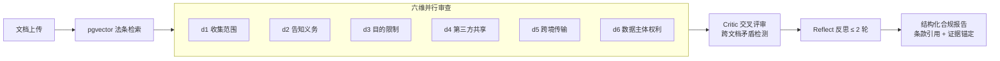

<div align="center">

# LegalEye 法眼

**面向中国出海企业的数据合规智能审查多智能体系统**

多智能体按 PIPL 合规维度并行审查隐私政策 / DPA / SCC 等文件，
输出带法规条款可追溯引用、数据流图谱推理、跨文档矛盾检测的结构化合规报告。

[](https://www.python.org/)
[](https://fastapi.tiangolo.com/)
[](https://www.langchain.com/langgraph)
[](https://react.dev/)
[](https://docs.docker.com/compose/)
[](LICENSE)


</div>

---

## 核心特性

- **六维并行审查管线**：LangGraph 编排 6 个维度 agent（收集范围 / 告知义务 / 目的限制 / 第三方共享 / 跨境传输 / 数据主体权利）并行审查，经 Critic 交叉评审与跨文档矛盾检测，Reflect 反思（≤ 2 轮）后输出结构化报告
- **证据闸门防幻觉**：每条 nonCompliant 判定强制双校验——证据须在原文命中 ≥ 8 连续字符，且命中该维度的行为信号词；任一不过即降级 `notApplicable`，模型无法"凭空报违规"
- **三层防误报改造**：prompt 要件纪律 + 代码豁免门 + 高风险规则触发前查合规信号，叠加适用性预筛门（堵漏检）与 DPA 语境豁免（堵合同误报）
- **法条可追溯**：pgvector 向量检索 PIPL 等法规原文，报告中的每条风险均带条款号引用与原文证据锚定
- **跨文档矛盾检测**：否定式声明与肯定式声明冲突识别，适用于"隐私政策 vs 附加协议"多文档场景
- **诚实的人工兜底**：低确信判定不硬报，转为 `unclear` 送人工复核——宁可不报也不误报

## 真实语料盲测（评估红线：不使用合成语料证明效果）

| 盲测集 | 样本 | 结果 |
|---|---|---|
| 真实隐私政策 | 12 份（淘宝 / 京东 / 微信 / SHEIN / Temu / 美团 / 支付宝 / 抖音 / 拼多多 / 速卖通 / 亚马逊 / eBay） | 误报 **0 / 12** |
| 真实跨境合同 | 10 份（欧盟 SCC 2021/914 与 915、中国《个人信息出境标准合同》、英国 ICO IDTA、AWS / Google / Microsoft / Shopify / Stripe / PayPal DPA） | 误报 **0 / 10**，70 项判定全量人工复核 |
| 证据闸门回归 | 124 条历史证据 | 零误杀 |

- 4 份超长 DPA（Google / Microsoft / Shopify / PayPal）全文审查（max-chars 50000），消除 8000 字符截断导致的跨境条款漏检（条款位于原文 23%~94% 处）
- **如实披露限制**：unclear 判定占 71.4%，依赖人工复核兜底——免费模型对英文法律文本语义映射偏弱，系统选择保守降级而非硬报；免费 LLM 存在 429 限流与超时，已内置长退避重试

详见 [docs/contract_eval_report.md](docs/contract_eval_report.md)（人工复核版）与 [docs/blind_eval_report.md](docs/blind_eval_report.md)。

## 系统架构



## 快速开始

```bash
# 1. 启动全套依赖 + 后端 + 前端（Postgres/pgvector、Redis、MinIO、backend、frontend）
cd infra
cp .env.example .env      # 填入你自己的密码与 LLM API Key
docker compose up -d

# 2. 验证
curl http://localhost:8000/health
# 前端: http://localhost:5173
```

本地开发（不走 Docker）：

```bash
# 后端
cd backend
python -m venv .venv && source .venv/Scripts/activate   # Windows Git Bash
uv pip install -r requirements.txt
uvicorn app.main:app --reload --port 8000

# 前端
cd frontend
pnpm install
pnpm run dev
```

## 技术栈

| 层 | 技术 |
|---|---|
| 后端 | Python 3.11+ · FastAPI · LangGraph · Celery · SQLAlchemy |
| 检索 | PostgreSQL + pgvector（法条向量化检索） |
| 队列 | Redis + Celery（审查任务异步化 / 熔断 / demo 限流） |
| 存储 | MinIO（合规文件 S3 存储） |
| 实时 | SSE（任务进度 / token 用量实时推送） |
| 前端 | React 18 · Vite · TypeScript · Tailwind · shadcn/ui · React Flow（数据流图谱可视化） |
| 部署 | Docker Compose 一键编排 · Nginx |

## 仓库结构

```
backend/     # Python 3.11+ FastAPI + LangGraph + Celery（六维 agent / 证据闸门 / 评估脚本）
frontend/    # React 18 + Vite + TS + Tailwind + shadcn/ui + React Flow
scripts/     # 入库 / 评估 / 部署脚本（evaluate.py · blind_eval.py）
data/        # 真实评估语料（real/ 12 份隐私政策 + real_contracts/ 10 份官方 SCC/DPA，均带来源 URL）
infra/       # docker-compose.yml / .env.example
docs/        # 全部文档与评估报告
```

## 文档索引

| 文档 | 内容 |
|---|---|
| [`docs/PROJECT.md`](docs/PROJECT.md) | 项目计划书（业务背景 / 竞品 / 商业模式 / 里程碑） |
| [`docs/PRD.md`](docs/PRD.md) | 产品需求（F1-F10 功能规格 / 异常清单 / 验收） |
| [`docs/DESIGN.md`](docs/DESIGN.md) | 前端视觉设计规范（色板 / 排版 / 组件 / 可视化） |
| [`docs/ARCHITECTURE.md`](docs/ARCHITECTURE.md) | 系统架构（技术栈 / 分层 / 12 条红线 / 验收） |
| [`docs/DATA_CONTRACT.md`](docs/DATA_CONTRACT.md) | 数据合同（API 契约 / 枚举字典 / 数据分级） |
| [`docs/TODO.md`](docs/TODO.md) | **开发台账（唯一执行顺序来源，含开发纪律）** |
| [`docs/contract_eval_report.md`](docs/contract_eval_report.md) | 跨境合同盲测报告（人工复核版 · 最终） |
| [`docs/blind_eval_report.md`](docs/blind_eval_report.md) | 隐私政策盲测报告（原始输出） |

## 评估复现

```bash
# 合同专项盲测（需在 .env / 环境变量中配置 LLM provider）
python scripts/blind_eval.py --help
python scripts/evaluate.py --help
```

## License

[MIT](LICENSE) © YuanZ567
