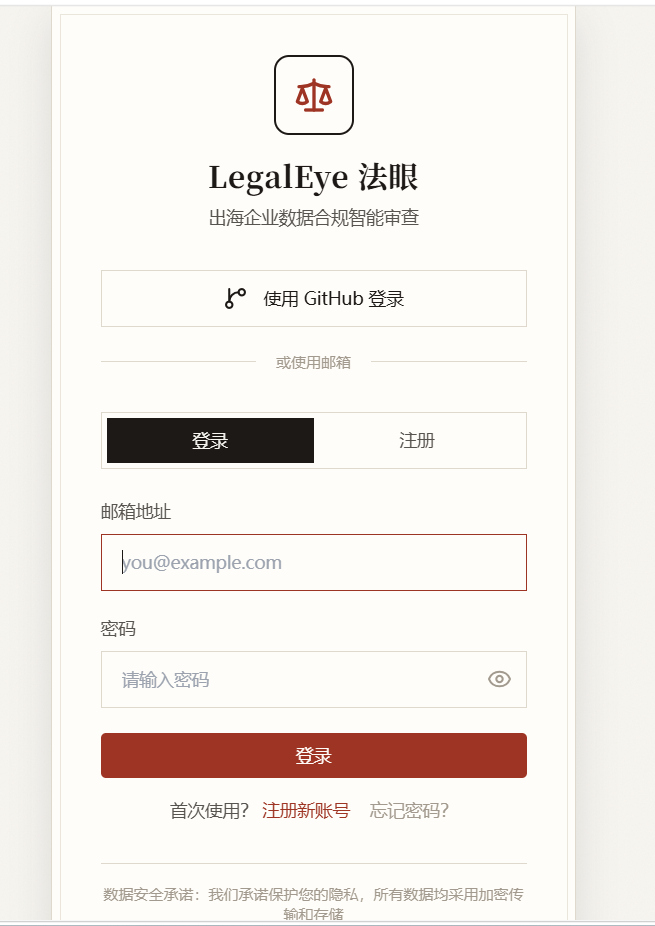
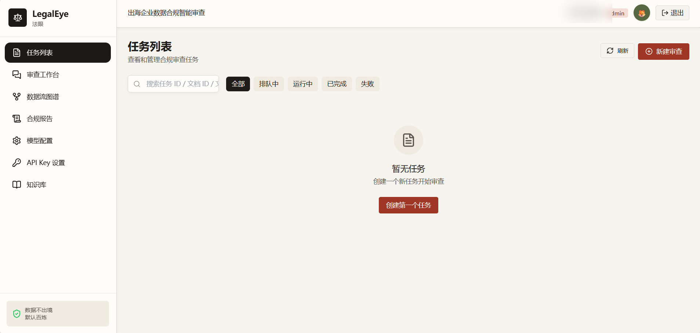
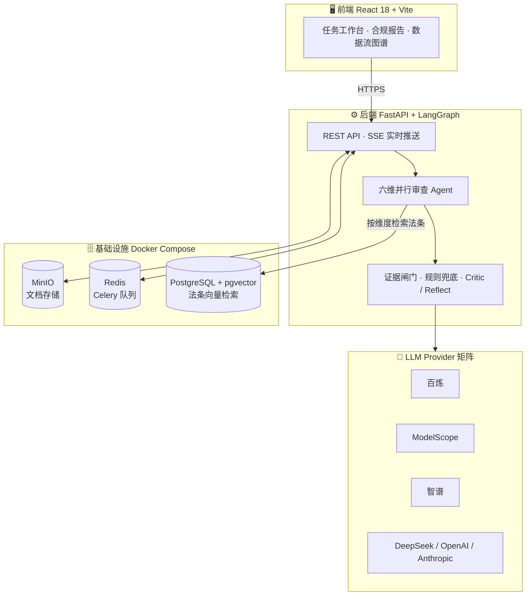

<div align="center">

# LegalEye 法眼

**面向中国出海企业的数据合规智能审查多智能体系统**

基于 LangGraph 编排六维合规审查 Agent，按 PIPL 逐条审查隐私政策 / DPA / SCC 等文件，
输出带法规条款可追溯引用、原文证据锚定、跨文档矛盾检测的结构化合规报告。

[](https://www.python.org/)
[](https://fastapi.tiangolo.com/)
[](https://www.langchain.com/langgraph)
[](https://react.dev/)
[](https://github.com/pgvector/pgvector)
[](https://docs.docker.com/compose/)
[](LICENSE)


</div>

---

## 📸 项目预览

| 登录 / 注册 | 任务工作台 |
|---|---|
|  |  |

*账号体系（邮箱注册 / GitHub OAuth）、任务管理、审查工作台、数据流图谱、合规报告、模型配置等完整功能界面。*

## ✨ 项目简介

中国《个人信息保护法》（PIPL）对出海企业的隐私政策、跨境数据传输合同提出了严格的合规要求，人工逐条审查一份动辄两万字的隐私政策或数十页的 DPA 成本高昂。

**LegalEye 用多智能体把这件事自动化**：文档上传后，6 个合规维度审查 Agent 并行工作，每个维度配备独立的审查提示词与 PIPL 法条向量检索；Critic 交叉评审汇总结果并检测跨文档矛盾；Reflect 对可疑结论反思修正（≤ 2 轮）；最终输出每条风险都带**条款号引用 + 原文证据锚定**的结构化报告。

系统内置两道确定性防线防止 LLM 幻觉：**证据闸门**（证据必须在原文命中 ≥ 8 连续字符且命中维度信号词，否则降级不报）与**高危规则兜底**（模型漏报时按规则强制报出）。

## 🧩 功能全景

### ⚙️ 合规审查引擎

| 能力 | 说明 |
|---|---|
| 🧵 六维并行审查 | 收集范围 / 告知义务 / 目的限制 / 第三方共享 / 跨境传输 / 数据主体权利 6 个 Agent 并行，互不阻塞 |
| 🔍 Critic 交叉评审 | 汇总各维判定，识别维度间冲突与跨文档矛盾（否定式 vs 肯定式声明冲突检测） |
| 🔄 Reflect 反思修正 | 对可疑结论自动反思重审，最多 2 轮，避免误报固化 |
| 🚧 证据闸门防幻觉 | nonCompliant 判定强制双校验：原文 ≥ 8 连续字符匹配 + 维度行为信号词命中，任一不过即降级 `notApplicable` |
| 🛟 高危规则兜底 | 模型漏报高风险违规时按规则表强制报出（规则 key 经维度归一化，带回归测试防静默失效） |
| 🛡️ 三层防误报 | prompt 要件纪律 + 代码豁免门 + 高风险规则触发前查合规信号；另设适用性预筛门（堵漏检）与 DPA 语境豁免（堵合同误报） |
| 🤝 低确信不硬报 | 确信不足转 `unclear` 送人工复核——宁可不报也不误报 |

### 📏 审查维度（依据 PIPL）

| 维度 | 审查内容 | 主要条款依据 |
|---|---|---|
| 🔞 d1 收集范围 | 超必要范围收集、捆绑授权、"拒绝即无法使用" | 第六条（最小必要原则） |
| 📢 d2 告知义务 | 未告知、告知不透明、隐私政策缺关键项 | 第十七条 |
| 🎯 d3 目的限制 | 处理目的不明确、超目的使用 | 第六条 |
| 🔗 d4 第三方共享 | 共享名单不透明、向第三方强制授权 | 第二十三条 |
| 🌏 d5 跨境传输 | 未单独同意、缺安全评估 / 标准合同备案 | 第三十八～四十条 |
| 🙋 d6 数据主体权利 | 删除 / 撤回同意 / 注销渠道缺失 | 第四十四～四十七条 |

### ⚡ 任务与实时性

| 能力 | 说明 |
|---|---|
| 📬 Celery 异步队列 | 审查任务后台化，worker 并发可配，失败熔断 |
| 📡 SSE 实时推送 | 任务进度、token 用量实时推送到前端（进度单调性防旧事件倒挂） |
| ⏱️ 多级超时保护 | 单次 LLM 调用 `wait_for` 包裹，429 限流长退避重试 |
| 🚦 Demo 限流 | 未登录 demo 模式按日限额，防滥用 |

### 📊 报告与可视化

| 能力 | 说明 |
|---|---|
| 📄 结构化合规报告 | 每份文档输出 7 项判定（6 审查维 + 1 跨维一致性）：判定 / 风险级别 / 条款 / 证据 |
| ⚖️ 条款可追溯 | 每条风险带 PIPL 条款号引用（ClauseRef 组件），条款号中文数字归一化匹配 |
| 📌 原文证据锚定 | 证据文本在原文中精确定位，点击可跳转核对 |
| 🕸️ 数据流图谱 | React Flow 渲染文档内数据流转图谱 |
| 🗺️ 编排过程可视化 | 智能体审查流水线的执行过程图示化呈现 |
| 🚨 风险分级 | high / medium / low / 需人工复核 徽标化展示 |

### 📂 文档与知识库

| 能力 | 说明 |
|---|---|
| 📥 文档管理 | 多文档上传入 MinIO（S3 兼容）存储，支持多文档联合审查 |
| 📖 法规知识库 | PIPL 等法规切片入库，pgvector 向量化，审查时按维度检索相关法条 |
| 📜 超长文档 | 全文审查支持 max-chars 50000，消除截断漏检（跨境条款可能位于原文 94% 处） |

### 🔐 账号与安全

| 能力 | 说明 |
|---|---|
| 🪪 登录注册 | 邮箱注册登录 + GitHub OAuth 第三方登录 |
| 🎫 JWT 双令牌 | access / refresh 双 token，改密、重置密码、头像昵称管理 |
| 🔏 密钥加密 | 平台 LLM API Key 与用户自有 Key 均 Fernet 加密落库 |
| 🔑 用户 API Key 托管 | 用户可自带模型 Key（BYOK），与平台默认 Key 隔离 |

### 🤖 模型管理

| 能力 | 说明 |
|---|---|
| 🌐 多 Provider 矩阵 | 百炼 / ModelScope / 智谱 / DeepSeek / OpenAI / Anthropic 统一接入（OpenAI 兼容 + Anthropic SDK 双协议） |
| 🔀 一键切换 | 模型激活 / 停用 / 删除（激活中模型保护性拒绝删除） |
| 🧾 调用记账 | 每次调用落库 token 用量，任务维度聚合，SSE 实时展示 |

### 🧪 评估体系

| 能力 | 说明 |
|---|---|
| 📐 盲测脚本 | `scripts/evaluate.py` 自动评估 + `scripts/blind_eval.py` 真实文档盲测 |
| 💾 断点续跑 | 每份完成即落盘，支持多模型分桶缓存与跨桶判重 |
| ♻️ 回归测试 | 证据闸门全量回归（124 条历史证据零误杀）、规则表归一化测试（pytest） |
| 🗃️ 真实语料 | 22 份真实文档评估语料随仓库提供（均带来源 URL，见 `data/`） |

## 🔬 真实语料盲测（评估红线：不使用合成语料证明效果）

| 盲测集 | 样本 | 结果 |
|---|---|---|
| 🛒 真实隐私政策 | 12 份（淘宝 / 京东 / 微信 / SHEIN / Temu / 美团 / 支付宝 / 抖音 / 拼多多 / 速卖通 / 亚马逊 / eBay） | 误报 **0 / 12** |
| 📑 真实跨境合同 | 10 份（欧盟 SCC 2021/914 与 915、中国《个人信息出境标准合同》、英国 ICO IDTA、AWS / Google / Microsoft / Shopify / Stripe / PayPal DPA） | 误报 **0 / 10**，70 项判定全量人工复核 |
| 🚧 证据闸门回归 | 124 条历史证据 | 零误杀 |

> - 4 份超长 DPA（Google / Microsoft / Shopify / PayPal）全文审查，消除 8000 字符截断导致的跨境条款漏检
> - **如实披露限制**：unclear 判定占 71.4%，依赖人工复核兜底——免费模型对英文法律文本语义映射偏弱，系统选择保守降级而非硬报；免费 LLM 存在 429 限流与超时，已内置长退避重试

详见 [docs/contract_eval_report.md](docs/contract_eval_report.md)（人工复核版）与 [docs/blind_eval_report.md](docs/blind_eval_report.md)。

## 🏗️ 系统架构



## 🚀 快速开始

```bash
# 1. 启动全套依赖 + 后端 + 前端（Postgres/pgvector、Redis、MinIO、backend、frontend）
cd infra
cp .env.example .env      # 填入你自己的密码与 LLM API Key
docker compose up -d

# 2. 验证
curl http://localhost:8000/health
# 前端: http://localhost:5173
```

本地开发（不走 Docker）：

```bash
# 后端
cd backend
python -m venv .venv && source .venv/Scripts/activate   # Windows Git Bash
uv pip install -r requirements.txt
uvicorn app.main:app --reload --port 8000

# 前端
cd frontend
pnpm install
pnpm run dev
```

## 🛠️ 技术栈

| 层 | 技术 |
|---|---|
| 后端 | Python 3.11+ · FastAPI · LangGraph · Celery · SQLAlchemy |
| 检索 | PostgreSQL + pgvector（法条向量化检索） |
| 队列 | Redis + Celery（审查任务异步化 / 熔断 / demo 限流） |
| 存储 | MinIO（合规文件 S3 存储） |
| 实时 | SSE（任务进度 / token 用量实时推送） |
| 前端 | React 18 · Vite · TypeScript · Tailwind · shadcn/ui · React Flow（数据流图谱可视化） |
| 部署 | Docker Compose 一键编排 · Nginx |

## 📁 仓库结构

```
backend/     # Python 3.11+ FastAPI + LangGraph + Celery（六维 agent / 证据闸门 / 评估脚本）
frontend/    # React 18 + Vite + TS + Tailwind + shadcn/ui + React Flow
scripts/     # 入库 / 评估 / 部署脚本（evaluate.py · blind_eval.py）
data/        # 真实评估语料（real/ 12 份隐私政策 + real_contracts/ 10 份官方 SCC/DPA，均带来源 URL）
infra/       # docker-compose.yml / .env.example
docs/        # 全部文档与评估报告
```

## 📚 文档索引

| 文档 | 内容 |
|---|---|
| [`docs/PROJECT.md`](docs/PROJECT.md) | 项目计划书（业务背景 / 竞品 / 商业模式 / 里程碑） |
| [`docs/PRD.md`](docs/PRD.md) | 产品需求（F1-F10 功能规格 / 异常清单 / 验收） |
| [`docs/DESIGN.md`](docs/DESIGN.md) | 前端视觉设计规范（色板 / 排版 / 组件 / 可视化） |
| [`docs/ARCHITECTURE.md`](docs/ARCHITECTURE.md) | 系统架构（技术栈 / 分层 / 12 条红线 / 验收） |
| [`docs/DATA_CONTRACT.md`](docs/DATA_CONTRACT.md) | 数据合同（API 契约 / 枚举字典 / 数据分级） |
| [`docs/TODO.md`](docs/TODO.md) | **开发台账（唯一执行顺序来源，含开发纪律）** |
| [`docs/contract_eval_report.md`](docs/contract_eval_report.md) | 跨境合同盲测报告（人工复核版 · 最终） |
| [`docs/blind_eval_report.md`](docs/blind_eval_report.md) | 隐私政策盲测报告（原始输出） |

## 🧪 评估复现

```bash
python scripts/blind_eval.py --help
python scripts/evaluate.py --help
```

## 📄 License

[MIT](LICENSE) © YuanZ567
